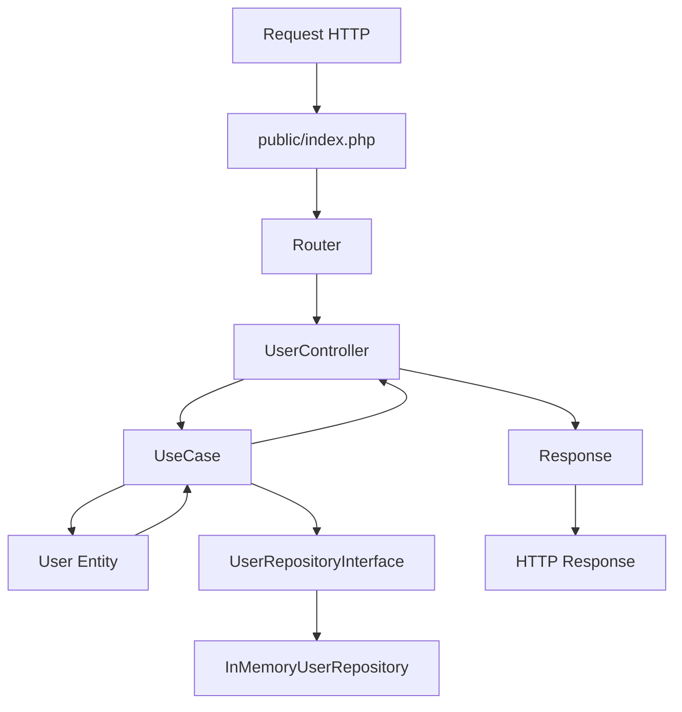

# Documentação da Arquitetura

## Visão Geral

Esta aplicação está organizada seguindo os princípios de **Arquitetura Limpa (Clean Architecture)** e **Domain-Driven Design (DDD)**, com separação clara de responsabilidades e inversão de dependência.

## Estrutura de Pastas

```plaintext
.
├── public/                   # Entrada da aplicação (index.php, assets)
│   ├── index.php
│   └── .htaccess
├── src/
│   ├── Core/                 # Camada de regras de negócio (Entidades e Casos de Uso)
│   │   ├── Entities/
│   │   │   └── User.php
│   │   └── UseCases/
│   │       ├── FindUserByIdUseCase.php
│   │       ├── ListUsersUseCase.php
│   │       └── RegisterUserUseCase.php
│   ├── Application/          # Camada de aplicação (interfaces e serviços)
│   │   ├── Interfaces/
│   │   │   └── UserRepositoryInterface.php
│   │   └── Services/
│   ├── Infra/                # Camada de infraestrutura (implementações externas)
│   │   ├── Http/             # Controllers, Request, Response (adaptadores externos)
│   │   │   ├── UserController.php
│   │   │   ├── Request.php
│   │   │   └── Response.php
│   │   ├── Routes/
│   │   │   └── Router.php
│   │   └── Persistence/      # Repositórios, integração com DB
│   │       └── InMemoryUserRepository.php
│   ├── Shared/               # Código compartilhado
│   │   └── Response/
│   │       └── SituacaoEnum.php
│   └── Enum/                 # Enums da aplicação
├── vendor/
├── composer.json
├── .htaccess
└── doc/
    └── arquitetura.md
```

## Explicação Detalhada de Cada Pasta

### 📁 `public/`
**Ponto de entrada da aplicação**

- **Propósito:** Receber todas as requisições HTTP e encaminhá-las para o restante da aplicação
- **Conteúdo:** 
  - `index.php` - Arquivo principal que inicializa a aplicação
  - `.htaccess` - Configurações do Apache para roteamento
- **Responsabilidade:** Única pasta acessível diretamente pelo servidor web

### 📁 `src/`
**Código-fonte principal da aplicação**

#### 📂 `Core/` - Camada de Regras de Negócio
**Contém as regras centrais do domínio da aplicação**

##### `Entities/`
- **Propósito:** Entidades do domínio que representam os objetos centrais do negócio
- **Arquivos atuais:** `User.php`
- **Características:**
  - Contêm apenas regras de negócio puras
  - Não possuem dependências externas
  - Representam conceitos do mundo real
  - São imutáveis e encapsuladas

##### `UseCases/`
- **Propósito:** Casos de uso que orquestram as entidades para realizar operações de negócio
- **Arquivos atuais:** 
  - `FindUserByIdUseCase.php` - Busca usuário por ID
  - `ListUsersUseCase.php` - Lista todos os usuários
  - `RegisterUserUseCase.php` - Registra novo usuário
- **Características:**
  - Implementam a lógica de aplicação
  - Coordenam entidades e serviços
  - Conhecem apenas interfaces (não implementações concretas)
  - Seguem o princípio de responsabilidade única

#### 📂 `Application/` - Camada de Aplicação
**Interfaces e serviços de aplicação**

##### `Interfaces/`
- **Propósito:** Definição de contratos que serão implementados pela infraestrutura
- **Arquivos atuais:** `UserRepositoryInterface.php`
- **Características:**
  - Definem contratos para repositórios e serviços
  - Permitem inversão de dependência
  - São conhecidas pelos casos de uso

##### `Services/`
- **Propósito:** Serviços de aplicação que podem ser reutilizados por diferentes casos de uso
- **Características:**
  - Implementam lógica de aplicação reutilizável
  - Podem coordenar múltiplos casos de uso
  - Fornecem funcionalidades transversais
- **Status atual:** Pasta vazia, pronta para futuros serviços

#### 📂 `Infra/` - Camada de Infraestrutura
**Implementações concretas e adaptadores externos**

##### `Http/`
- **Propósito:** Adaptadores de entrada/saída para comunicação HTTP
- **Arquivos atuais:**
  - `UserController.php` - Controlador para operações de usuário
  - `Request.php` - Classe para manipular dados de entrada
  - `Response.php` - Classe para formatar respostas
- **Características:**
  - Recebem requisições externas
  - Convertem dados para objetos internos
  - Retornam respostas formatadas
  - São adaptadores da camada externa

##### `Routes/`
- **Propósito:** Definição e gerenciamento das rotas da aplicação
- **Arquivos atuais:** `Router.php`
- **Características:**
  - Mapeiam URLs para controllers ou casos de uso
  - Definem padrões de URL
  - Gerenciam middleware quando necessário

##### `Persistence/`
- **Propósito:** Implementações concretas de repositórios e integração com banco de dados
- **Arquivos atuais:** `InMemoryUserRepository.php`
- **Características:**
  - Implementam interfaces conhecidas pelos casos de uso
  - Contêm lógica de acesso a dados
  - Atualmente usando implementação em memória
  - Seguem o padrão Repository

#### 📂 `Shared/` - Código Compartilhado
**Utilitários e tipos comuns a toda a aplicação**

##### `Response/`
- **Propósito:** Enums e tipos relacionados a respostas
- **Arquivos atuais:** `SituacaoEnum.php`
- **Características:**
  - Definições de tipos e constantes para respostas
  - Código reutilizável entre camadas
  - Não possui dependências de outras camadas

#### 📂 `Enum/` - Enums da Aplicação
**Enums e constantes da aplicação**

- **Propósito:** Centralizar enums e constantes da aplicação
- **Status atual:** Pasta vazia, pronta para futuros enums
- **Características:**
  - Enums específicos da aplicação
  - Constantes e tipos enumerados
  - Código reutilizável entre camadas

### 📁 `vendor/`
**Dependências externas**

- **Propósito:** Dependências gerenciadas pelo Composer
- **Características:** Não deve ser alterada manualmente
- **Conteúdo:** Bibliotecas de terceiros e autoloader

### 📄 `composer.json`
**Configuração do Composer**

- **Propósito:** Gerenciar dependências e configuração de autoload
- **Configuração atual:**
  - Autoload PSR-4 com namespace `App\` apontando para `src/`
  - Script para iniciar servidor de desenvolvimento
  - Sem dependências externas no momento

### 📄 `.htaccess`
**Configuração do Apache**

- **Propósito:** Controlar regras de roteamento e segurança
- **Conteúdo:** Redirecionamentos, regras de segurança e configurações do servidor

## Princípios Arquiteturais

### 🔄 Inversão de Dependência
- **Casos de uso** conhecem apenas **interfaces** (`UserRepositoryInterface`)
- **Infraestrutura** implementa essas interfaces (`InMemoryUserRepository`)
- **Dependências** apontam para abstrações, não implementações

### 🏗️ Separação por Camadas
- Cada pasta tem uma **responsabilidade clara**
- **Facilita** manutenção, testes e evolução
- **Reduz** acoplamento entre componentes

### 🎯 Responsabilidade Única
- Cada classe tem **uma única razão para mudar**
- **Facilita** compreensão e modificação
- **Melhora** testabilidade

### 🔒 Encapsulamento
- **Entidades** são imutáveis e encapsuladas
- **Regras de negócio** ficam protegidas
- **Dados** são acessados através de métodos

## Fluxo de Dados



## Funcionalidades Implementadas

### 👤 Gestão de Usuários
- **Entidade:** `User.php` - Representa um usuário do sistema
- **Casos de Uso:**
  - `RegisterUserUseCase` - Registra novo usuário
  - `FindUserByIdUseCase` - Busca usuário por ID
  - `ListUsersUseCase` - Lista todos os usuários
- **Repositório:** `InMemoryUserRepository` - Implementação em memória
- **Controller:** `UserController` - Endpoints HTTP para usuários

### 🔄 Sistema de Rotas
- **Router:** `Router.php` - Gerenciamento de rotas da aplicação
- **Request/Response:** Classes para manipular dados HTTP

## Benefícios desta Arquitetura

1. **Manutenibilidade:** Código organizado e fácil de entender
2. **Testabilidade:** Componentes isolados e testáveis
3. **Flexibilidade:** Fácil troca de implementações (ex: trocar repositório em memória por banco de dados)
4. **Escalabilidade:** Estrutura preparada para crescimento
5. **Reutilização:** Código compartilhado e bem estruturado

## Convenções de Nomenclatura

- **Entidades:** PascalCase (ex: `User`)
- **Casos de Uso:** PascalCase com sufixo UseCase (ex: `RegisterUserUseCase`)
- **Controllers:** PascalCase com sufixo Controller (ex: `UserController`)
- **Repositórios:** PascalCase com sufixo Repository (ex: `InMemoryUserRepository`)
- **Interfaces:** PascalCase com sufixo Interface (ex: `UserRepositoryInterface`)
- **Enums:** PascalCase com sufixo Enum (ex: `SituacaoEnum`)

## Próximos Passos

1. **Implementar testes unitários** para casos de uso e entidades
2. **Adicionar validação** nos casos de uso
3. **Implementar repositório com banco de dados** real
4. **Adicionar autenticação e autorização**
5. **Implementar logging e tratamento de erros**
6. **Adicionar documentação da API**

---

*Esta documentação deve ser atualizada conforme a evolução da arquitetura do projeto.* 