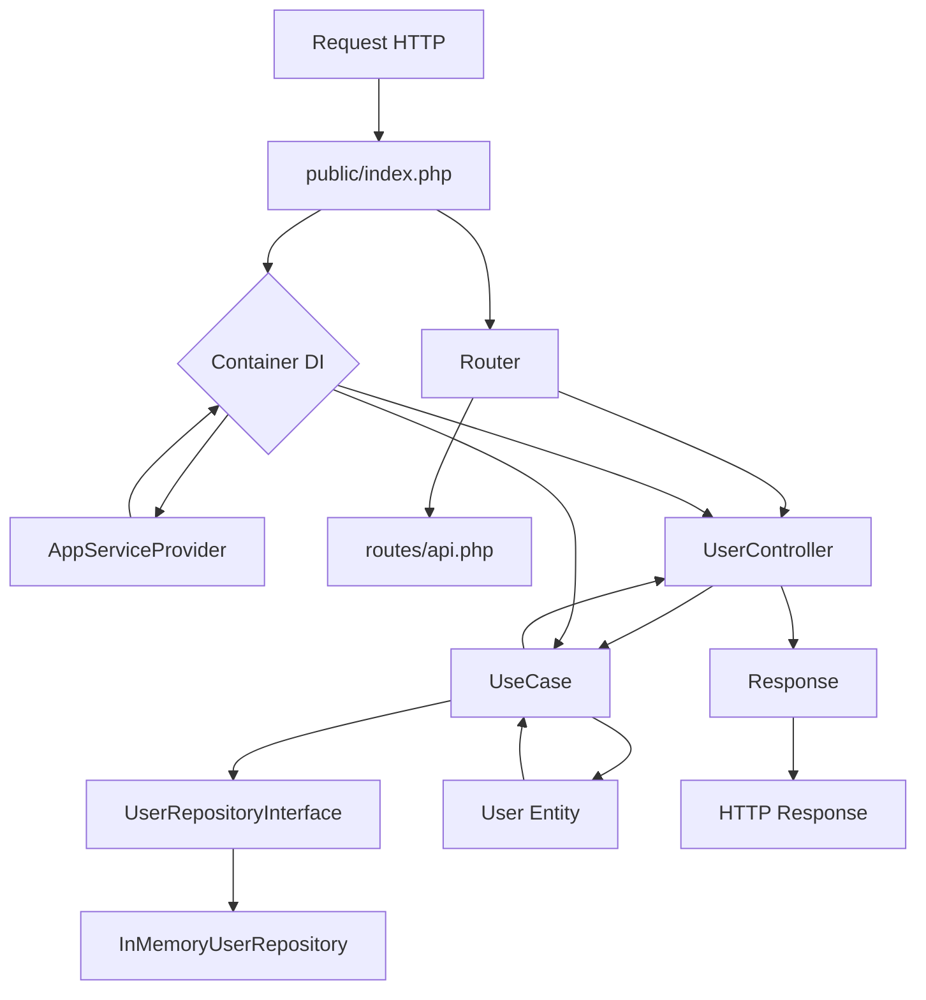

# Documentação da Arquitetura

## Visão Geral

Esta aplicação está organizada seguindo os princípios de **Arquitetura Limpa (Clean Architecture)** e **Domain-Driven Design (DDD)**, com separação clara de responsabilidades e inversão de dependência. A arquitetura foi projetada para ser um **mini-framework** base para futuros projetos, inspirando-se em conceitos do Laravel como **Service Container**, **Service Providers** e um sistema de **rotas declarativas**.

## Estrutura de Pastas

```plaintext
.
├── public/                   # Entrada da aplicação (index.php, assets)
│   ├── index.php
│   └── .htaccess
├── src/
│   ├── Core/                 # Camada de regras de negócio (Entidades e Casos de Uso)
│   │   ├── Entities/
│   │   │   └── User.php
│   │   └── UseCases/
│   │       ├── FindUserByIdUseCase.php
│   │       ├── ListUsersUseCase.php
│   │       └── RegisterUserUseCase.php
│   ├── Application/          # Camada de aplicação (interfaces, provedores de serviço)
│   │   ├── Interfaces/
│   │   │   └── UserRepositoryInterface.php
│   │   └── Providers/
│   │       └── AppServiceProvider.php
│   ├── Infra/                # Camada de infraestrutura (implementações externas)
│   │   ├── DI/
│   │   │   └── Container.php
│   │   ├── Http/             # Controllers, Request, Response (adaptadores externos)
│   │   │   ├── UserController.php
│   │   │   ├── Request.php
│   │   │   └── Response.php
│   │   ├── Routes/
│   │   │   └── Router.php
│   │   └── Persistence/      # Repositórios, integração com DB
│   │       └── InMemoryUserRepository.php
│   ├── Shared/               # Código compartilhado
│   │   └── Response/
│   │       └── SituacaoEnum.php
│   └── Enum/                 # Enums da aplicação
├── routes/
│   └── api.php
├── vendor/
├── composer.json
├── .htaccess
└── doc/
    └── arquitetura.md
```

## Explicação Detalhada de Cada Pasta

### 📁 `public/`
**Ponto de entrada da aplicação**

- **Propósito:** Receber todas as requisições HTTP e inicializar a aplicação.
- **`index.php`:** Bootstrap da aplicação: cria o container de injeção de dependência, registra os provedores de serviço e despacha as rotas.

### 📁 `src/`
**Código-fonte principal da aplicação**

#### 📂 `Core/` - Camada de Regras de Negócio
- **Entidades:** Objetos de negócio puros (ex: `User.php`).
- **Casos de Uso:** Orquestram as entidades para realizar operações de negócio (ex: `RegisterUserUseCase`).

#### 📂 `Application/` - Camada de Aplicação
- **Interfaces:** Contratos para repositórios e outros serviços (ex: `UserRepositoryInterface`).
- **Providers:** Provedores de serviço que registram as dependências no container (ex: `AppServiceProvider`).

#### 📂 `Infra/` - Camada de Infraestrutura
- **DI:** Contém o **Service Container** (`Container.php`), responsável por gerenciar a injeção de dependências.
- **Http:** Controllers, Request e Response.
- **Routes:** O `Router.php` que é responsável por carregar as rotas do arquivo `routes/api.php` e despachar a requisição para o controller apropriado.
- **Persistence:** Implementações concretas de repositórios (ex: `InMemoryUserRepository`).

### 📁 `routes/`
- **`api.php`:** Arquivo para definição de todas as rotas da API, de forma declarativa, similar ao Laravel.

## Princípios Arquiteturais

### 🔄 Inversão de Dependência e Service Container
O coração da arquitetura é o **Service Container** (`Infra/DI/Container.php`). Ele é responsável por resolver e injetar as dependências automaticamente. As classes não instanciam mais suas dependências diretamente, elas as recebem via construtor. O `AppServiceProvider` é responsável por registrar as interfaces e suas implementações no container, tornando o código desacoplado e fácil de manter.

### 🏗️ Separação por Camadas e Rotas Declarativas
As rotas agora são definidas no arquivo `routes/api.php`, de forma clara e concisa. O `Router` lê este arquivo e, usando o Service Container, resolve o controller e suas dependências para responder à requisição. Isso separa a definição das rotas da sua implementação.

## Fluxo de Dados



## Próximos Passos

1.  **Criar comandos artisan:** Implementar uma ferramenta de linha de comando para tarefas como criar migrations.
2.  **Implementar testes unitários** para casos de uso e entidades.
3.  **Adicionar validação** nos casos de uso.
4.  **Implementar repositório com banco de dados** real.
5.  **Adicionar autenticação e autorização**.

---

*Esta documentação deve ser atualizada conforme a evolução da arquitetura do projeto.*